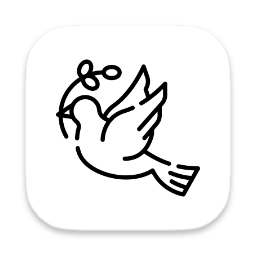

<p align="center">
  
</p>

# Pigeon
### The Native API Client for macOS. Fast, File-Based, and Fluid.

[](https://github.com/pokhrelashok/pigeon/releases/latest)
[](https://github.com/pokhrelashok/pigeon/actions)
[](https://opensource.org/licenses/MIT)

Pigeon is a high-performance, native macOS API client designed for developers who value speed, privacy, and version control. Built with **Swift** and **SwiftUI**, it offers a buttery-smooth experience that Electron-based tools simply can't match.

[**Download Latest DMG**](https://github.com/pokhrelashok/pigeon/releases/latest/download/Pigeon.dmg) • [Report a Bug](https://github.com/pokhrelashok/pigeon/issues/new/choose) • [Contributing](CONTRIBUTING.md)

---

## ✨ Why Pigeon?

### 🚀 Native Performance
No more waiting for Electron to boot. Pigeon is a pure Swift app that uses native macOS components. It launches instantly and handles thousands of requests with a tiny memory footprint.

### 📄 Git-Friendly Data Model
Your collections aren't trapped in a proprietary cloud or a massive, opaque JSON blob. Pigeon saves everything as plain text files in your own folders. Branch, merge, and pull-request your API collections just like your code.

### 🔐 Privacy First
Pigeon is local-only. There are no accounts to create, no tracking, and your sensitive API data never leaves your machine unless you choose to push it to your own Git repository.

### 📂 Arc-Style Workspaces
Manage multiple projects with ease. The sidebar allows you to swipe between workspaces seamlessly, keeping your context organized.

---

## 🆚 The Comparison

| Feature | **Pigeon** | **Bruno** | **Postman** |
| :--- | :---: | :---: | :---: |
| **Engine** | Native (Swift) | Electron | Electron |
| **Speed** | ⚡ Instant | 🟢 Good | 🟠 Heavy |
| **Memory Usage** | 🍃 Ultra-low | 🟡 Moderate | 🔴 High |
| **Data Storage** | Plain Files | Plain Files | Proprietary Cloud |
| **Privacy** | 🔒 Local-only | 🔒 Local-only | 🔓 Cloud-first |
| **UI/UX** | macOS Native | Cross-platform | Web-standard |
| **Offline Support** | 100% | 100% | Limited |

---

## 🛠 Features

- **Intuitive Editor**: Support for Params, Headers, Auth, and various Body types (JSON, XML, Multipart, etc.).
- **Environment Management**: Switch between Dev, Staging, and Prod variables in a single click.
- **Variable Resolution**: Dynamic variable injection using `{{variable}}` syntax.
- **Response Viewer**: Pretty-printed JSON, raw view, and detailed header inspection.
- **Quick Search**: Powerful search across requests and response bodies.
- **Shortcuts**: Fully keyboard-driven workflow with native macOS shortcuts (`Cmd+Enter` to send).

---

## 🚀 Getting Started

1. **Download**: Grab the [latest `.dmg`](https://github.com/pokhrelashok/pigeon/releases/latest/download/Pigeon.dmg).
2. **Install**: Drag Pigeon to your `/Applications` folder.
3. **Open Workspace**: Point Pigeon to any folder on your machine containing `.bru` or `.yml` request files.

---

## 🛠 Troubleshooting (Security Warnings)

Since Pigeon is currently unsigned, macOS will show a warning when you first open it ("Pigeon can't be opened because Apple cannot check it for malicious software").

**To open Pigeon:**
1. **Right-click** (or Control-click) the Pigeon app icon and select **Open**.
2. A dialog will appear; click **Open** again.
3. This is only required once. Alternatively, go to **System Settings > Privacy & Security** and click **Open Anyway**.

**If the "Move to Trash" warning persists:**
Modern macOS (Sequoia+) is very strict with unsigned apps. If the above doesn't work, you can clear the quarantine attribute manually via Terminal:
```bash
xattr -cr /Applications/Pigeon.app
```
Then try opening it again normally.


---

## 🏗 Technical Overview

Pigeon is built on a modular architecture designed for extensibility:

- **Core**: Swift 6.0+, Observation Framework.
- **Networking**: URLSession-based with custom `RequestBuilder`.
- **UI**: SwiftUI with AppKit bridges for advanced macOS windowing.
- **Persistence**: Atomic file-system writes with debounced session management.

For a detailed architectural breakdown, see the [Technical Specification](docs/architecture.md).

---

## 🤝 Contributing

We love contributions! Whether you're reporting a bug, suggesting a feature, or submitting a pull request, please check out our [Contributing Guidelines](CONTRIBUTING.md).

### 🐛 Reporting Issues
If you find a bug or have a suggestion, please [open an issue](https://github.com/pokhrelashok/pigeon/issues/new/choose) using one of our templates.


---

## 📄 License
Pigeon is released under the **MIT License**. See [LICENSE](LICENSE) for details.

---
<p align="center">
  Made with ❤️ for the macOS Developer Community.
</p>